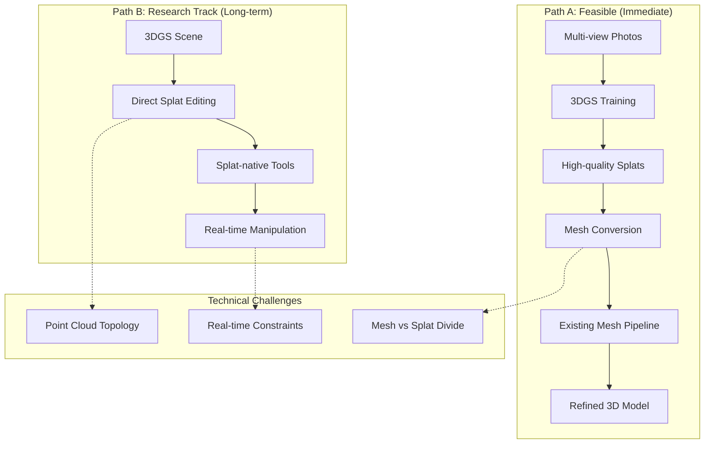
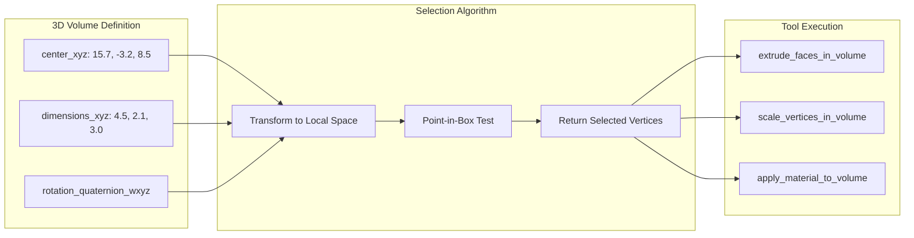

# Technical Architecture Diagram

## Current vs. Proposed Architecture


## Phase-by-Phase Implementation Flow

```mermaid
graph LR
    subgraph "Phase 1: Foundation"
        P1A[Analyze Current Pipeline] --> P1B[Design JSON Schema]
        P1B --> P1C[Build Volume Selection]  
        P1C --> P1D[Test Framework]
    end

    subgraph "Phase 2: 3DGS Integration"
        P2A[Photo Input] --> P2B[3DGS Training]
        P2B --> P2C[Splat to Mesh]
        P2C --> P2D[Existing Pipeline]
    end

    subgraph "Phase 3: Enhanced Tools"
        P3A[Volume-based Selection] --> P3B[New Tool Library]
        P3B --> P3C[Spatial Validation]
    end

    P1D --> P2A
    P2D --> P3A
```



## JSON Schema Evolution

### Before (Flawed)
```json
{
  "suggested_action": "Reshape the volume in the upper-left; apply 'Armored Steel Plate' texture."
}
```

### After (Corrected)
```json
{
  "tool_calls": [
    {
      "function_name": "extrude_faces_in_volume",
      "parameters": {
        "volume_identifier": {
          "type": "box",
          "center_xyz": [15.7, -3.2, 8.5],
          "dimensions_xyz": [4.5, 2.1, 3.0],
          "rotation_quaternion_wxyz": [0.966, 0.0, 0.259, 0.0]
        },
        "extrude_vector": [0.0, 0.0, 0.5]
      }
    },
    {
      "function_name": "apply_material_to_volume", 
      "parameters": {
        "volume_identifier": {
          "type": "box",
          "center_xyz": [15.7, -3.2, 8.5],
          "dimensions_xyz": [4.5, 2.1, 3.0]
        },
        "material_name": "Armored_Steel_Plate"
      }
    }
  ]
}
```

## Integration Strategy: Path A vs Path B



## Critical Fix: Volume-based Selection



## Risk Mitigation Architecture

```mermaid
graph TB
    subgraph "Input Validation"
        IV1[JSON Schema Validation]
        IV2[Coordinate Range Check]
        IV3[Volume Bounds Verification]
    end

    subgraph "Processing Safety"
        PS1[Spatial Index Optimization]
        PS2[Error Recovery]
        PS3[Fallback Mechanisms]
    end

    subgraph "Output Verification"
        OV1[Geometric Integrity Check]
        OV2[Performance Monitoring]
        OV3[Quality Metrics]
    end

    IV1 --> PS1
    IV2 --> PS2
    IV3 --> PS3
    PS1 --> OV1
    PS2 --> OV2
    PS3 --> OV3